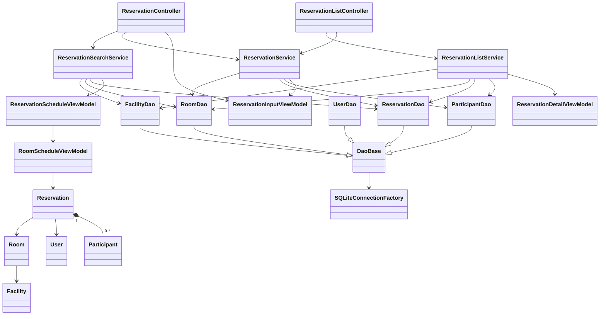
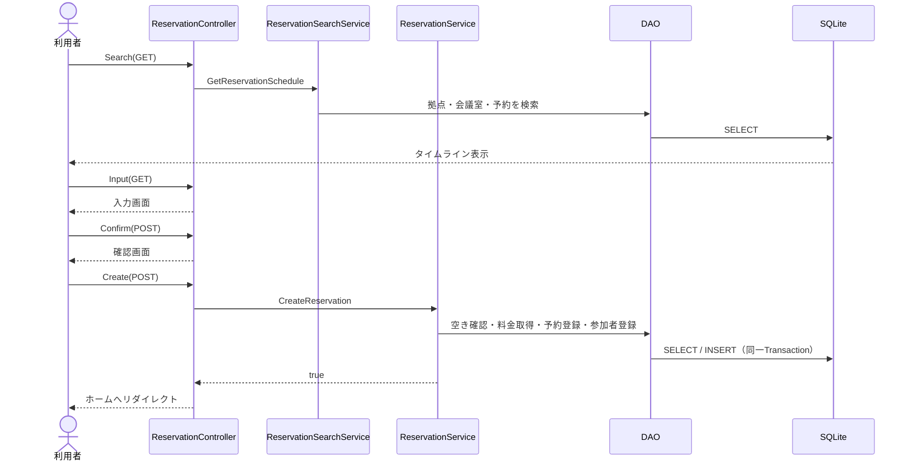

# 会議室予約システム 設計・コード解説

## はじめに

この資料は、C#とASP.NET MVCを学び始めて3〜4か月ほどの人が、現在のコードを読んで処理の流れを説明できるようになることを目的としています。

このシステムは **ASP.NET MVC 5 / .NET Framework 4.7.2** で作られています。データベースにはSQLiteを使用し、Entity Frameworkは使用していません。DAOクラスが生SQLを実行してデータを読み書きします。

この資料では、特に次の流れを意識してください。

```text
ブラウザ
  ↓ リクエスト
Controller
  ↓ 業務処理を依頼
Service
  ↓ データの読み書きを依頼
DAO
  ↓ パラメータ化したSQL
SQLiteデータベース
```

> 現在はログイン機能が未実装です。そのため、ログイン中のユーザーは一時的に `U001` として扱われます。

---

## 1. システム全体概要

このシステムでは、利用者が次の操作を行えます。

- 拠点、日付、人数を指定して会議室の予約状況を検索する
- タイムラインから空いている時間を選び、本予約を登録する
- 日時を指定して空いている会議室を検索し、仮予約を登録する
- 仮予約を本予約へ変更する
- 登録済みの本予約を変更する
- 本予約または仮予約をキャンセルする
- 本予約、仮予約、実施済み予約を一覧表示する

予約状態は次の3種類です。

| 値 | C#の名前 | 意味 |
|---:|---|---|
| 0 | `Tentative` | 仮予約 |
| 1 | `Confirmed` | 本予約 |
| 2 | `Cancelled` | キャンセル済み |

「実施済み」という予約状態はDBにはありません。`Confirmed`で、終了日時が現在時刻より前の予約を、一覧表示時に実施済みと判断します。

```text
本予約   : Status == Confirmed かつ EndDateTime >= 現在時刻
実施済み : Status == Confirmed かつ EndDateTime <  現在時刻
仮予約   : Status == Tentative
```

予約できる時間は09:00〜18:00で、15分単位です。本予約の料金は次の式で計算します。

```text
15分料金 = HourlyRate / 4
合計料金 = 15分料金 × 選択したスロット数
```

画面に表示される料金はプレビューです。DBへ保存する正式な料金は、`ReservationService`が会議室の料金をDBから読み直して計算します。

---

## 2. フォルダ構成

```text
ReservationManagementApp/
├─ App_Data/
│  ├─ Initialize.sql              DB作成用SQL
│  └─ reservation.db              SQLiteデータベース
├─ App_Start/
│  └─ RouteConfig.cs              URLルーティング設定
├─ Controllers/
│  ├─ ReservationController.cs    新しい予約を作る画面の制御
│  └─ ReservationListController.cs 既存予約の一覧・変更・取消
├─ DataAccess/
│  ├─ DaoBase.cs                  DAO共通処理
│  ├─ SQLiteConnectionFactory.cs  SQLite接続の作成
│  ├─ FacilityDao.cs              拠点データ操作
│  ├─ RoomDao.cs                  会議室データ操作
│  ├─ ReservationDao.cs           予約データ操作
│  ├─ ParticipantDao.cs           参加者データ操作
│  └─ UserDao.cs                  ユーザーDAOの土台
├─ Models/
│  ├─ Entities/                   DBのデータを表すクラス
│  └─ ViewModels/                 画面に必要なデータを表すクラス
├─ Services/
│  ├─ ReservationSearchService.cs 会議室検索
│  ├─ ReservationService.cs       予約登録・変更・取消
│  └─ ReservationListService.cs   予約一覧作成
├─ Views/
│  ├─ Reservation/                新規予約用画面
│  ├─ ReservationList/            既存予約操作用画面
│  └─ Shared/_Layout.cshtml        全画面共通レイアウト
├─ Global.asax.cs                 アプリケーション開始処理
└─ Web.config                     接続文字列などの設定
```

---

## 3. クラス一覧

### Controller

| クラス | 主な役割 |
|---|---|
| `ReservationController` | 新規本予約と新規仮予約の検索・入力・登録を受け付ける |
| `ReservationListController` | 既存予約の一覧、仮予約確定、変更、キャンセルを受け付ける |

### Service

| クラス | 主な役割 |
|---|---|
| `ReservationSearchService` | 予約状況検索、仮予約可能な会議室の検索、仮予約上限確認 |
| `ReservationService` | 予約の登録・更新・キャンセル、料金計算、トランザクション |
| `ReservationListService` | 予約一覧を画面用ViewModelへ変換し、本予約と実施済みを分ける |

### DAO

| クラス | 主な役割 |
|---|---|
| `SQLiteConnectionFactory` | `Web.config`の接続文字列を読み、SQLiteConnectionを開く |
| `DaoBase` | Connection共有、Command作成、Parameter追加、日時変換 |
| `FacilityDao` | `facilities`テーブルを読む |
| `RoomDao` | `rooms`テーブルを読む |
| `ReservationDao` | `reservations`テーブルを検索・登録・更新する |
| `ParticipantDao` | `participants`テーブルを検索・一括登録・削除する |
| `UserDao` | 現在はコンストラクタだけを持つDAOの土台 |

### Entity

| クラス | 対応するデータ |
|---|---|
| `User` | ユーザー |
| `Facility` | 拠点 |
| `Room` | 会議室 |
| `Reservation` | 予約。`List<Participant>`も持つ |
| `Participant` | 予約参加者。Userとは関連付けない |
| `ReservationStatus` | 仮予約・本予約・キャンセル済みを表すenum |
| `UserRole` | 営業・総務を表すenum。権限制御は未実装 |

### ViewModel

| クラス | 使用目的 |
|---|---|
| `ReservationScheduleViewModel` | 1拠点・1日分のタイムライン検索結果 |
| `RoomScheduleViewModel` | タイムライン上の1会議室と、その日の予約一覧 |
| `ReservationInputViewModel` | 予約入力・確認・変更フォーム |
| `ReservationDetailViewModel` | ホーム画面に表示する予約詳細 |

---

## 4. クラス図

矢印は「左側のクラスが右側のクラスを呼び出す、または使用する」ことを表します。



> `Reservation`はC#上では`RoomId`と`UserId`を持ちます。`Room`や`User`オブジェクトそのものをプロパティとして持っているわけではありません。

---

## 5. 各層の役割

### Controllerの役割

Controllerはブラウザから送られた値を受け取ります。入力が正しいか確認し、必要なServiceを呼び、表示するViewまたは次のURLを返します。

ControllerにSQL、料金計算、重複判定は書きません。

### Serviceの役割

Serviceは業務ルールを扱います。例えば次の処理です。

- 仮予約は1人3件まで
- 営業時間は09:00〜18:00
- 予約は15分単位
- 予約直前に空き状況を再確認する
- 正式な料金を計算する
- 複数のDAO更新を1つのTransactionで処理する

### DAOの役割

DAOはDBとのやり取りだけを担当します。

- SQLを作る
- SQLiteParameterへ値を設定する
- SQLを実行する
- 検索結果をEntityへ変換する

DAOは画面遷移や料金計算を担当しません。

### Entityの役割

EntityはDBから読み取ったデータや、DBへ保存するデータを表します。画面専用の表示文字列などは持ちません。

### ViewModelの役割

ViewModelは、特定の画面やフォームで必要なデータをまとめます。DBの1テーブルと一致する必要はありません。

---

## 6. Controllerのメソッド

### ReservationController

新しい予約または仮予約を作る流れを担当します。

| メソッド | HTTP | 引数 | 戻り値 | 何をするか | 呼び出し元 | 次に呼ぶもの |
|---|---|---|---|---|---|---|
| `Search` | GET | `facilityId`, `date`, `capacity` | `ActionResult` | 指定日の会議室予約状況を表示する | ホームの本予約検索フォーム | `ReservationSearchService.GetReservationSchedule` |
| `TemporarySearch` | GET | `facilityId`, `date`, `startTime`, `endTime`, `capacity` | `ActionResult` | 指定時間に仮予約できる会議室を表示する | ホームの仮予約検索フォーム | `CanCreateTemporaryReservation`, `SearchAvailableRoomsForTemporary` |
| `Input` | GET | `roomId`, `roomName`, `facilityName`, `date`, `startTime`, `endTime` | `ActionResult` | タイムラインで選んだ内容を入力画面へ渡す。DB更新はしない | `Search`画面の「次へ」 | `Reservation/Input.cshtml` |
| `Confirm` | POST | `ReservationInputViewModel model` | `ActionResult` | 入力内容を確認画面へ渡す。DB更新はしない | 新規予約入力画面 | `Reservation/Confirm.cshtml` |
| `Create` | POST | `ReservationInputViewModel model` | `ActionResult` | 本予約を登録する | 新規予約確認画面 | `ReservationService.CreateReservation` |
| `CreateTemporary` | POST | `roomId`, `date`, `startTime`, `endTime` | `ActionResult` | 仮予約を登録する | 仮予約検索結果画面 | `ReservationService.CreateTemporaryReservation` |

`Confirm`、`Create`、`CreateTemporary`には`ValidateAntiForgeryToken`が付いています。これは、別サイトから勝手にPOSTされる攻撃を防ぐためです。

### ReservationListController

すでに存在する予約を表示・操作する流れを担当します。

| メソッド | HTTP | 引数 | 戻り値 | 何をするか | 呼び出し元 | 次に呼ぶもの |
|---|---|---|---|---|---|---|
| `Index` | GET | `listType` | `ActionResult` | 本予約・仮予約・実施済みを切り替えてホームへ表示する | 既定URL、各一覧タブ | `GetReservationsForList`, `PopulateIndexViewData` |
| `Cancel` | POST | `reservationId`, `listType` | `ActionResult` | 本予約または仮予約をキャンセルする | 一覧の「キャンセル」 | `ReservationService.CancelReservation` |
| `TemporaryInput` | GET | `reservationId` | `ActionResult` | 仮予約を本予約にするための入力内容を作る | 仮予約一覧の「予約確定」 | `FindReservationDetail`, `ToInputViewModel` |
| `TemporaryConfirm` | POST | `reservationId`, `model` | `ActionResult` | 仮予約確定の入力内容を確認画面へ渡す | 仮予約確定入力画面 | `ConfirmTemporary.cshtml`経由で確認画面を表示 |
| `ConfirmTemporary` | POST | `reservationId`, `model` | `ActionResult` | 既存の仮予約を本予約へ更新する | 仮予約確定確認画面 | `ReservationService.ConfirmTemporaryReservation` |
| `Edit` | GET | `reservationId` | `ActionResult` | 本予約を読み、変更入力画面へ渡す | 本予約一覧の「変更」 | `FindReservationDetail`, `ToInputViewModel` |
| `EditConfirm` | POST | `model` | `ActionResult` | 変更内容を確認画面へ渡す | 変更入力画面 | `ConfirmUpdate.cshtml`経由で確認画面を表示 |
| `Update` | POST | `model` | `ActionResult` | 本予約を更新する | 変更確認画面 | `ReservationService.UpdateReservation` |

補助メソッドは次のとおりです。

| メソッド | 引数 | 戻り値 | 役割 |
|---|---|---|---|
| `PopulateIndexViewData` | `listType` | なし | 拠点一覧と選択中タブをViewDataへ入れる |
| `GetReservationsForList` | `listType` | `List<ReservationDetailViewModel>` | タブに対応するServiceメソッドを選ぶ |
| `NormalizeListType` | `listType` | `string` | 不明な値が来た場合は本予約タブへ戻す |
| `FindReservationDetail` | `reservationId`, `status` | `ReservationDetailViewModel` | ユーザーと状態で取得した一覧から対象IDを探す |
| `ToInputViewModel` | `detail` | `ReservationInputViewModel` | 一覧用ViewModelを入力用ViewModelへ変換する |
| `CreateReservationListService` | なし | `ReservationListService` | Controllerで使用するServiceを作る |
| `CreateReservationService` | なし | `ReservationService` | Controllerで使用するServiceを作る |

現在の`TemporaryInput` Actionは`Input.cshtml`を表示し、そこから`TemporaryInput.cshtml`を部分Viewとして読みます。同様に、確認画面では`ConfirmTemporary.cshtml`と`ConfirmUpdate.cshtml`が中継用Viewとして使われています。

---

## 7. Serviceのメソッド

### ReservationSearchService

| メソッド | 引数 | 戻り値 | 何をするか | 呼び出し元 | 次に呼ぶもの |
|---|---|---|---|---|---|
| `CanCreateTemporaryReservation` | `userId` | `bool` | ユーザーの仮予約が3件未満か確認する | `ReservationController.TemporarySearch`、同Service内 | `ReservationDao.CountTemporaryReservations` |
| `GetReservationSchedule` | `facilityId`, `date`, `capacity` | `ReservationScheduleViewModel` | 拠点と会議室を読み、会議室ごとに当日の予約をまとめる | `ReservationController.Search` | `FacilityDao.FindById`, `RoomDao.FindByFacilityId`, `ReservationDao.FindByRoomAndDate` |
| `SearchAvailableRoomsForTemporary` | `facilityId`, `date`, `startTime`, `endTime`, `capacity`, `userId` | `List<Room>` | 条件に合い、指定時間に空いている会議室だけ返す | `ReservationController.TemporarySearch` | `CanCreateTemporaryReservation`, `RoomDao.FindByFacilityId`, `ReservationDao.IsRoomAvailable` |
| `IsValidReservationTime` | `startTime`, `endTime` | `bool` | 営業時間内、開始より終了が後、15分単位か確認する | 同Service内 | なし |
| `CombineDateAndTime` | `date`, `time` | `DateTime` | 日付と時刻を1つのDateTimeにする | 同Service内 | なし |

### ReservationService

| メソッド | 引数 | 戻り値 | 何をするか | 呼び出し元 | 次に呼ぶもの |
|---|---|---|---|---|---|
| `CreateReservation` | `model`, `userId` | `bool` | 空き確認、料金計算、本予約と参加者の登録を行う | `ReservationController.Create` | `RoomDao`, `ReservationDao`, `ParticipantDao` |
| `CreateTemporaryReservation` | `roomId`, `date`, `startTime`, `endTime`, `userId` | `bool` | 3件上限と空きを再確認し、Tentative予約を登録する | `ReservationController.CreateTemporary` | `RoomDao`, `ReservationDao` |
| `ConfirmTemporaryReservation` | `reservationId`, `model`, `userId` | `bool` | 所有者とTentative状態を確認し、既存予約をConfirmedへ更新する | `ReservationListController.ConfirmTemporary` | `RoomDao`, `ReservationDao`, `ParticipantDao` |
| `UpdateReservation` | `model`, `userId` | `bool` | 所有者とConfirmed状態を確認し、日時・内容・参加者・料金を更新する | `ReservationListController.Update` | `RoomDao`, `ReservationDao`, `ParticipantDao` |
| `CancelReservation` | `reservationId`, `userId` | `bool` | 所有者を確認し、状態をCancelledへ変更する。参加者は削除しない | `ReservationListController.Cancel` | `ReservationDao.FindById`, `ReservationDao.UpdateStatus` |

重要な補助メソッドです。

| メソッド | 戻り値 | 役割 |
|---|---|---|
| `ExecuteInTransaction` | `bool` | ConnectionとTransactionを作り、複数DAOの処理をまとめてCommitまたはRollbackする |
| `TryGetReservationRange` | `bool` | ViewModelを確認し、開始日時と終了日時を作る |
| `IsValidReservationTime` | `bool` | 営業時間と15分単位を確認する |
| `CombineDateAndTime` | `DateTime` | 日付と時刻を結合し、タイムゾーンなしのJSTローカル日時として扱う |
| `CalculateTotalPrice` | `int` | 15分単位の料金を計算する。`checked`で整数の桁あふれも検出する |
| `CopyParticipants` | `List<Participant>` | nullを空Listに変え、参加者Listをコピーする |

### ReservationListService

| メソッド | 引数 | 戻り値 | 何をするか | 呼び出し元 | 次に呼ぶもの |
|---|---|---|---|---|---|
| `GetReservationList` | `userId`, `status` | `List<ReservationDetailViewModel>` | 予約者と状態で検索し、会議室名・拠点名・参加者を付けた画面用データを作る | `ReservationListController`、同Service内 | 全4種のDAO |
| `GetFacilities` | なし | `List<Facility>` | ホームの拠点プルダウン用データを返す | `PopulateIndexViewData` | `FacilityDao.FindAll` |
| `GetCurrentConfirmedReservations` | `userId` | `List<ReservationDetailViewModel>` | Confirmedのうち、終了日時が現在以降の予約を返す | `GetReservationsForList` | `GetReservationList` |
| `GetCompletedReservations` | `userId` | `List<ReservationDetailViewModel>` | Confirmedのうち、終了日時が現在より前の予約を返す | `GetReservationsForList` | `GetReservationList` |

---

## 8. DAOのメソッド

### SQLiteConnectionFactory / DaoBase

| クラス・メソッド | 引数 | 戻り値 | 役割 |
|---|---|---|---|
| `SQLiteConnectionFactory.OpenConnection` | なし | `SQLiteConnection` | 接続を開き、外部キー制約を有効にする |
| `GetConnectionString` | 設定名 | `string` | `Web.config`から接続文字列を読む |
| `DaoBase.Execute<T>` | DB処理 | `T` | 共有Connectionがあればそれを使い、なければ新しいConnectionを開く |
| `CreateCommand` | Connection, Transaction, SQL | `SQLiteCommand` | SQL Commandを作り、Transactionを設定する |
| `AddParameter` | Command, 名前, 型, 値 | なし | SQLiteParameterを追加する。nullは`DBNull.Value`へ変える |
| `ToDatabaseDateTime` | `DateTime` | `string` | 日時をJSTのISO-8601文字列へ変換する |
| `FromDatabaseDateTime` | `string` | `DateTime` | DB文字列をDateTimeへ戻す |

### FacilityDao

| メソッド | 引数 | 戻り値 | 役割 | 主な呼び出し元 |
|---|---|---|---|---|
| `FindAll` | なし | `List<Facility>` | 全拠点を取得する | `ReservationListService.GetFacilities` |
| `FindById` | `facilityId` | `Facility` | IDで拠点を1件取得する | `ReservationSearchService`, `ReservationListService` |
| `MapFacility` | `SQLiteDataReader` | `Facility` | SELECT結果の1行をFacilityへ変換する | FacilityDao内 |

### RoomDao

| メソッド | 引数 | 戻り値 | 役割 | 主な呼び出し元 |
|---|---|---|---|---|
| `FindByFacilityId` | `facilityId`, `capacity` | `List<Room>` | 拠点内で必要人数以上の会議室を取得する。capacityがnullなら人数条件を付けない | `ReservationSearchService` |
| `FindById` | `roomId` | `Room` | IDで会議室を1件取得する | `ReservationService`, `ReservationListService` |
| `MapRoom` | `SQLiteDataReader` | `Room` | SELECT結果の1行をRoomへ変換する | RoomDao内 |

### ReservationDao

| メソッド | 引数 | 戻り値 | 役割 | 主な呼び出し元 |
|---|---|---|---|---|
| `FindById` | `reservationId` | `Reservation` | IDで予約を1件取得する。参加者は取得しない | `ReservationService` |
| `FindByRoomAndDate` | `roomId`, `date` | `List<Reservation>` | 会議室の指定日に重なる予約を取得する。Cancelledは除外する | `ReservationSearchService` |
| `FindByUserAndStatus` | `userId`, `status` | `List<Reservation>` | 予約者と状態で予約を取得する | `ReservationListService` |
| `CountTemporaryReservations` | `userId` | `int` | ユーザーのTentative予約数を数える | `ReservationSearchService`, `ReservationService` |
| `IsRoomAvailable` | `roomId`, `start`, `end`, `excludeReservationId` | `bool` | 指定時間に重なる予約が0件か確認する。変更時は自分自身を除外できる | `ReservationSearchService`, `ReservationService` |
| `Insert` | `reservation` | `int` | 予約を登録し、自動採番されたReservationIdを返す | `ReservationService` |
| `Update` | `reservation` | `bool` | 予約全体を更新する | `ReservationService` |
| `UpdateStatus` | `reservationId`, `status` | `bool` | 予約状態だけを更新する | `ReservationService.CancelReservation` |
| `AddReservationParameters` | Command, Reservation | なし | INSERT/UPDATEで共通するParameterを追加する | ReservationDao内 |
| `MapReservation` | Reader | `Reservation` | SELECT結果の1行をReservationへ変換する | ReservationDao内 |

### ParticipantDao

| メソッド | 引数 | 戻り値 | 役割 | 主な呼び出し元 |
|---|---|---|---|---|
| `FindByReservationId` | `reservationId` | `List<Participant>` | 予約IDに属する参加者を取得する | `ReservationListService` |
| `InsertAll` | `reservationId`, `participants` | `bool` | 参加者をまとめて登録する。共有TransactionがなければDAO内でTransactionを作る | `ReservationService` |
| `DeleteByReservationId` | `reservationId` | `int` | 予約IDに属する参加者を削除し、削除件数を返す。0件も正常 | `ReservationService` |
| `InsertParticipants` | Connection, Transaction, ID, 参加者 | なし | Listをforeachし、参加者を1件ずつ登録する | `InsertAll` |

`UserDao`は現在、接続方法を受け取るコンストラクタだけを持ち、検索・登録メソッドはまだありません。

---

## 9. 新規本予約の処理フロー



登録直前にも`IsRoomAvailable`を呼びます。検索後に別の利用者が予約を登録している可能性があるためです。

---

## 10. 新規仮予約の処理フロー

```text
ReservationList/Index
  ↓ 条件を入力
Reservation/TemporarySearch (GET)
  ↓ 仮予約3件上限を確認
  ↓ 条件に合う会議室を取得
  ↓ IsRoomAvailableで空いている部屋だけ残す
  ↓ 1部屋選択
Reservation/CreateTemporary (POST)
  ↓ 3件上限と空きを再確認
  ↓ Status = TentativeでINSERT
ReservationList/Index
```

仮予約では`Title`、`Remarks`、`TotalPrice`をnullで登録できます。参加者はこの時点では登録しません。

---

## 11. 仮予約から本予約への処理フロー

```text
ReservationList/Index?listType=temporary
  ↓ 「予約確定」
ReservationList/TemporaryInput (GET)
  ↓ Title・Participants・Remarksを入力
ReservationList/TemporaryConfirm (POST)
  ↓ 内容を確認
ReservationList/ConfirmTemporary (POST)
  ↓ 対象が本人のTentative予約か確認
  ↓ 自分自身の予約IDを除外して空き状況を再確認
  ↓ 料金を計算
  ↓ ReservationをConfirmedへUPDATE
  ↓ 既存参加者をDELETEして新しい参加者をINSERT
  ↓ Commit
ReservationList/Index
```

新しい予約をINSERTするのではなく、既存のTentative予約をUPDATEします。

---

## 12. 予約変更の処理フロー

```text
ReservationList/Index?listType=confirmed
  ↓ 「変更」
ReservationList/Edit (GET)
  ↓ 既存値を入力画面へ表示
ReservationList/EditConfirm (POST)
  ↓ 内容を確認
ReservationList/Update (POST)
  ↓ 本人のConfirmed予約か確認
  ↓ 自分自身の予約IDを除外して重複確認
  ↓ 会議室料金をDBから取得して再計算
  ↓ ReservationをUPDATE
  ↓ 参加者をDELETE後にINSERT
  ↓ Commit
ReservationList/Index
```

---

## 13. キャンセルの処理フロー

```text
予約一覧の「キャンセル」
  ↓ POST + AntiForgeryToken
ReservationListController.Cancel
  ↓ ReservationService.CancelReservation
  ↓ ReservationDao.FindById
  ↓ 予約者が現在のユーザーか確認
  ↓ ReservationDao.UpdateStatus(..., Cancelled)
  ↓ 一覧へ戻る
```

予約行は削除せず、StatusをCancelledへ変更します。参加者も削除しません。実施済み一覧にはキャンセルボタンを表示しません。

---

## 14. タイムライン検索の処理フロー

1. ホームで拠点・日付・人数を入力します。
2. `ReservationController.Search`が値を受け取ります。
3. `ReservationSearchService.GetReservationSchedule`が拠点を確認します。
4. `RoomDao.FindByFacilityId`が会議室を取得します。
5. 会議室ごとに`ReservationDao.FindByRoomAndDate`を呼びます。
6. Serviceが`ReservationScheduleViewModel`を組み立てます。
7. `Search.cshtml`のJavaScriptが09:00〜18:00を15分ずつ、合計36スロットに分けます。
8. 予約とスロットの時間が重なっていれば、そのスロットを押せなくします。
9. 利用者が開始スロットと終了スロットをクリックします。
10. JavaScriptが連続範囲、利用時間、料金プレビューを表示します。
11. 「次へ」でRoomId、会議室名、拠点名、日付、開始時刻、終了時刻を`Input`へGET送信します。

タイムライン上の料金は表示専用で、`TotalPrice`としてPOSTしません。

---

## 15. DBテーブルとEntityの対応

### users → User

| DB列 | Entityプロパティ | 型 |
|---|---|---|
| `user_id` | `UserId` | `string` |
| `login_id` | `LoginId` | `string` |
| `password_hash` | `PasswordHash` | `string` |
| `name` | `Name` | `string` |
| `email` | `Email` | `string` |
| `department` | `Department` | `string` |
| `role` | `Role` | `UserRole` |

### facilities → Facility

| DB列 | Entityプロパティ | 型 |
|---|---|---|
| `facility_id` | `FacilityId` | `string` |
| `facility_name` | `FacilityName` | `string` |
| `address` | `Address` | `string` |
| `description` | `Description` | `string` |

### rooms → Room

| DB列 | Entityプロパティ | 型 |
|---|---|---|
| `room_id` | `RoomId` | `string` |
| `facility_id` | `FacilityId` | `string` |
| `room_name` | `RoomName` | `string` |
| `capacity` | `Capacity` | `int` |
| `hourly_rate` | `HourlyRate` | `int` |
| `equipment` | `Equipment` | `string` |
| `description` | `Description` | `string` |

### reservations → Reservation

| DB列 | Entityプロパティ | 型 |
|---|---|---|
| `reservation_id` | `ReservationId` | `int` |
| `user_id` | `UserId` | `string` |
| `room_id` | `RoomId` | `string` |
| `start_datetime` | `StartDateTime` | `DateTime` |
| `end_datetime` | `EndDateTime` | `DateTime` |
| `title` | `Title` | `string` |
| `remarks` | `Remarks` | `string` |
| `status` | `Status` | `ReservationStatus` |
| `total_price` | `TotalPrice` | `int?` |

### participants → Participant

| DB列 | Entityプロパティ | 型・補足 |
|---|---|---|
| `reservation_id` | 直接のプロパティなし | DAOメソッドの引数として扱う |
| `participant_name` | `Name` | `string` |
| `company_name` | `CompanyName` | `string` |
| `is_private` | `IsPrivate` | `bool`。DBでは0または1 |

`Participant`にはParticipantIdがありません。DBの主キーは`reservation_id`、`participant_name`、`company_name`の組み合わせです。

---

## 16. ViewModelを使う理由

Entityだけでは、画面に必要な情報を1つにまとめられない場合があります。

例えば`Reservation`は`RoomId`を持っていますが、画面に表示したい`RoomName`や`FacilityName`は持っていません。Entityへ画面専用項目を追加すると、DBデータと画面データの区別が分かりにくくなります。

そこで一覧画面では`ReservationDetailViewModel`を使います。

```text
Reservation Entity
  + Room Entity
  + Facility Entity
  + Participant一覧
          ↓ Serviceがまとめる
ReservationDetailViewModel
          ↓
Index.cshtmlへ表示
```

`ReservationInputViewModel`には`[Required]`が付いています。ASP.NET MVCはPOSTされた値をこのクラスへ入れ、入力必須項目が空なら`ModelState.IsValid`をfalseにします。

---

## 17. 初心者が理解しにくい箇所

### ラムダ式とFunc

`ReservationService`には次のような形があります。

```csharp
return ExecuteInTransaction((roomDao, reservationDao, participantDao) =>
{
    // DB処理
});
```

`{ }`の中の処理そのものを`ExecuteInTransaction`へ渡しています。`ExecuteInTransaction`はDAOを用意して処理を実行し、成功ならCommit、失敗ならRollbackします。

### using

```csharp
using (var connection = _connectionFactory.OpenConnection())
using (var transaction = connection.BeginTransaction())
{
    // DB処理
}
```

`using`を抜けると、ConnectionやTransactionが自動的に破棄されます。DB接続を閉じ忘れないために必要です。

### nullable型

`int?`や`DateTime?`はnullを持てる型です。

- `capacity`は指定なしを許可するため`int?`
- 仮予約の`TotalPrice`は未確定なので`int?`
- GETの`date`は未入力を検出するため`DateTime?`

### DateTimeKind.Unspecified

DBにはJSTローカル時刻をISO-8601形式のTEXTで保存します。末尾に`Z`や`+09:00`を付けず、JSTの時計表示そのものを保存するため、C#では`DateTimeKind.Unspecified`として扱います。

保存例：

```text
2026-09-07T09:00:00.000
```

### MVCのListモデルバインド

参加者入力欄のnameは次の形です。

```text
Participants[0].Name
Participants[0].CompanyName
Participants[0].IsPrivate
```

この名前でPOSTすると、ASP.NET MVCが自動的に`List<Participant>`へ復元します。`Participants.Index`というhidden項目も、この復元を助けるために使われます。

### ViewData

画面の中心となるデータはModelで渡します。拠点一覧、選択中タブ、検索条件の再表示などの補助情報はViewDataで渡します。

```csharp
ViewData["Facilities"] = _reservationListService.GetFacilities();
ViewData["SelectedListType"] = listType;
```

---

## 18. トランザクション

トランザクションは、複数のDB更新を「全部成功」または「全部失敗」にまとめる仕組みです。

本予約登録では、予約と参加者を別々のテーブルへ登録します。

```text
Transaction開始
  ↓
reservationsへINSERT
  ↓
participantsへINSERT
  ↓
両方成功 → Commit
途中で失敗 → Rollback
```

予約だけ登録されて参加者登録に失敗する、という中途半端な状態を防ぎます。

`ReservationService`がConnectionとTransactionを作り、それを各DAOのコンストラクタへ渡します。そのため、複数のDAOが同じTransactionへ参加できます。

---

## 19. 重複予約判定

`ReservationDao.IsRoomAvailable`は、次の条件で時間の重なりを探します。

```sql
existing.StartDateTime < requestedEnd
AND existing.EndDateTime > requestedStart
```

例として、既存予約が10:00〜11:00の場合を考えます。

| 新しい予約 | 結果 | 理由 |
|---|---|---|
| 09:00〜10:00 | 予約可能 | 10:00で接しているだけ |
| 09:30〜10:30 | 重複 | 10:00〜10:30が重なる |
| 10:30〜11:30 | 重複 | 10:30〜11:00が重なる |
| 11:00〜12:00 | 予約可能 | 11:00で接しているだけ |

Cancelled予約は重複判定から除外します。予約変更時は`excludeReservationId`を指定し、変更対象の予約自身も除外します。

検索時だけでなく登録・変更の直前にも確認するため、検索後にほかの予約が入った場合も二重予約を防げます。

---

## 20. SQLiteParameter

SQLへ利用者の入力値を直接つなげると、SQLインジェクションの危険があります。このシステムでは、値をSQLiteParameterとして渡しています。

現在のコードと同じ考え方の例です。

```csharp
const string sql = @"
SELECT room_id, room_name
FROM rooms
WHERE room_id = @roomId;";

using (SQLiteCommand command = CreateCommand(connection, transaction, sql))
{
    AddParameter(command, "@roomId", DbType.String, roomId);
    // SQLを実行する
}
```

`roomId`の内容はSQL文ではなく、単なる値として扱われます。これにより、安全性を保ちながら文字列や数値をSQLへ渡せます。

`IsRoomAvailable`では条件に応じてSQLの一部を追加していますが、予約IDの値そのものは文字列連結せず、`@excludeReservationId`として渡しています。

---

## 21. まず読むとよい順番

初めてコードを読む場合は、次の順番がおすすめです。

1. `Models/Entities`で、扱うデータを確認する
2. `Models/ViewModels`で、各画面が必要とするデータを確認する
3. `ReservationController`で新規予約の画面遷移を追う
4. `ReservationListController`で既存予約の操作を追う
5. Controllerから呼ばれるServiceメソッドを読む
6. Serviceから呼ばれるDAOメソッドを読む
7. DAOのSQLと`Initialize.sql`のテーブルを対応させる
8. 最後に`DaoBase`の接続共有と`ReservationService`のTransactionを読む

最初から`DaoBase`やTransactionのラムダ式を理解しようとせず、まず「画面 → Controller → Service → DAO」という一本の流れを追うと理解しやすくなります。
