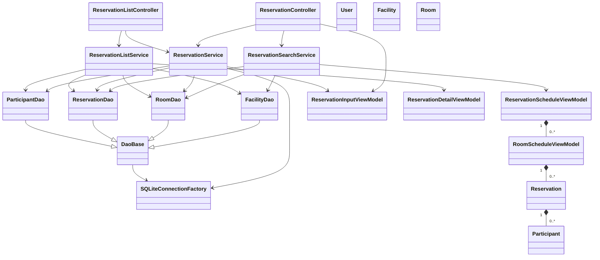
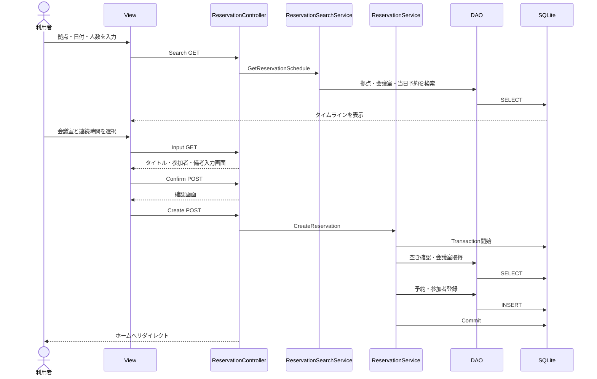
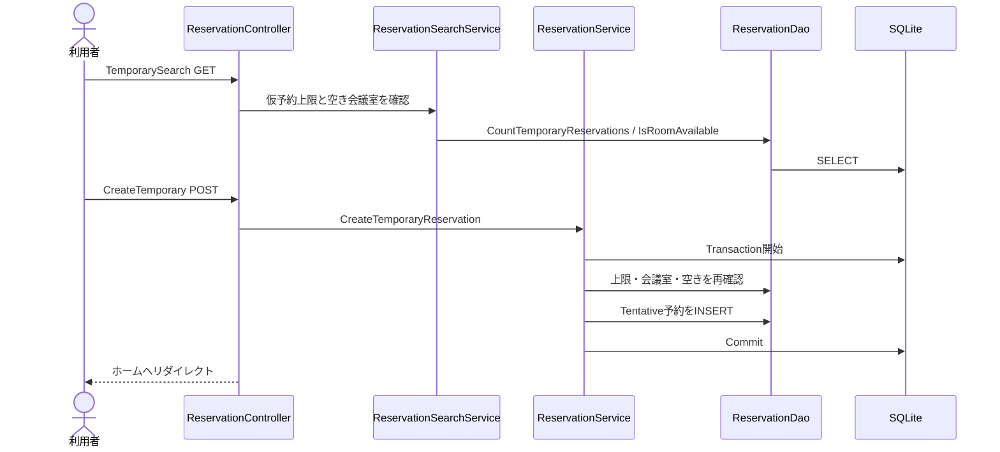
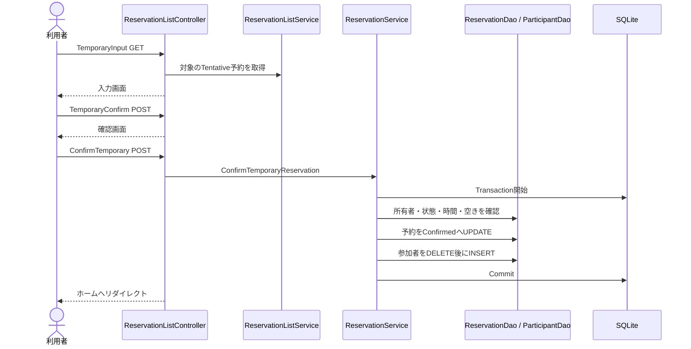
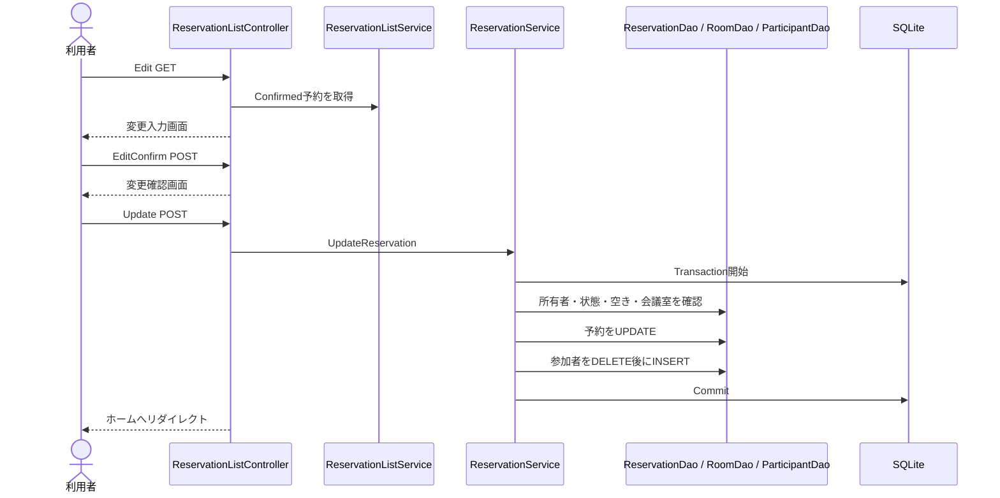
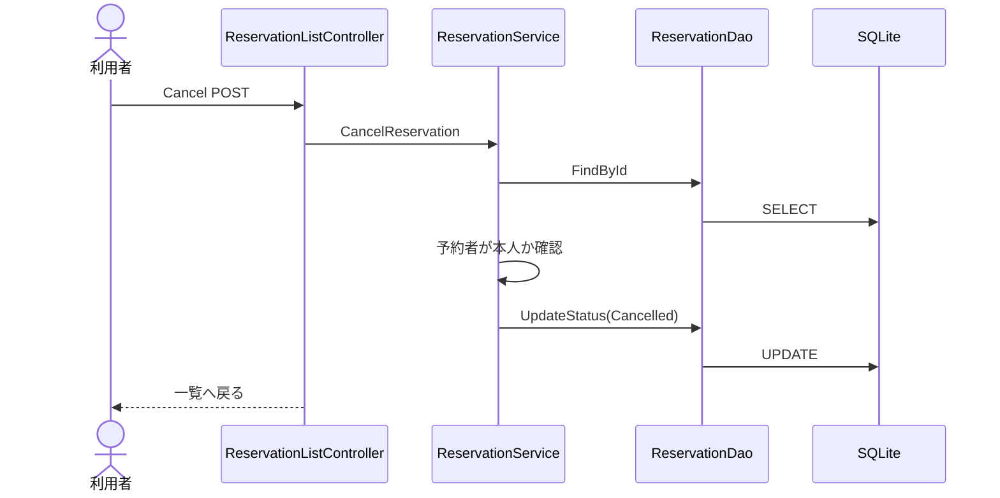

# 会議室予約システム 設計・コード解説 第2版

## この資料について

この資料は、C#とASP.NET MVCを学び始めて3〜4か月ほどの人を対象にしています。

目標は、現在のコードを読んだときに次のことを自分の言葉で説明できるようになることです。

- どのクラスが何を担当しているか
- 画面からDBまで、処理がどの順番で進むか
- 各メソッドが何を確認し、何を行い、何を返すか
- なぜService、DAO、Entity、ViewModelを分けているか

この第2版は、現在のリポジトリに存在するコードを基準にしています。

メソッドの詳しい説明は、読みやすいように次の3ファイルへ分けています。

- [Controllerメソッド一覧](methods/controller_methods.md)
- [Serviceメソッド一覧](methods/service_methods.md)
- [DAOメソッド一覧](methods/dao_methods.md)

---

## 1. システム全体概要

このシステムは、社内の会議室を検索し、本予約・仮予約・変更・キャンセルを行うWebアプリケーションです。

使用している主な技術は次のとおりです。

| 項目 | 内容 |
|---|---|
| Webフレームワーク | ASP.NET MVC 5 |
| 実行環境 | .NET Framework 4.7.2 |
| View | Razor 3 |
| DB | SQLite |
| DBアクセス | DAOパターンと生SQL |
| SQLの値渡し | SQLiteParameter |
| Entity Framework | 使用していない |

現在はログイン機能が未実装です。Controllerでは、ログイン中のユーザーを一時的に`U001`として扱います。

`RouteConfig`の既定ルートは`ReservationListController.Index`です。そのため、アプリのルートURLを開くとホームの予約一覧が表示されます。

### 予約状態

| 数値 | enum | 画面上の意味 |
|---:|---|---|
| 0 | `Tentative` | 仮予約 |
| 1 | `Confirmed` | 本予約 |
| 2 | `Cancelled` | キャンセル済み |

「実施済み」というenumはありません。次の条件で画面表示時に判断します。

```text
本予約   = Confirmed かつ EndDateTime >= 現在時刻
実施済み = Confirmed かつ EndDateTime <  現在時刻
仮予約   = Tentative
```

Cancelled予約はホーム画面の一覧タブには表示しません。

### 主な業務ルール

- 営業時間は09:00〜18:00
- 予約は15分単位
- 仮予約はユーザー1人につき3件まで
- ConfirmedとTentativeは会議室の空き判定対象
- Cancelledは空き判定対象外
- 正式料金はServiceがDBのHourlyRateを使って計算
- 予約登録・変更の直前に、空き状況をもう一度確認
- 日時はJSTローカル時刻をISO-8601形式のTEXTとして保存

---

## 2. フォルダ構成

```text
ReservationManagementApp/
├─ App_Data/
│  ├─ Initialize.sql
│  └─ reservation.db
├─ App_Start/
│  └─ RouteConfig.cs
├─ Controllers/
│  ├─ ReservationController.cs
│  └─ ReservationListController.cs
├─ DataAccess/
│  ├─ DaoBase.cs
│  ├─ SQLiteConnectionFactory.cs
│  ├─ FacilityDao.cs
│  ├─ RoomDao.cs
│  ├─ ReservationDao.cs
│  └─ ParticipantDao.cs
├─ Models/
│  ├─ Entities/
│  └─ ViewModels/
├─ Services/
│  ├─ ReservationSearchService.cs
│  ├─ ReservationService.cs
│  └─ ReservationListService.cs
└─ Views/
   ├─ Reservation/
   ├─ ReservationList/
   └─ Shared/
```

### フォルダの役割

| フォルダ | 役割 |
|---|---|
| `Controllers` | URLから値を受け取り、Serviceを呼び、Viewを返す |
| `Services` | 予約制限、料金、Transactionなどの業務処理 |
| `DataAccess` | SQLを使ってSQLiteを読み書きする |
| `Models/Entities` | DBのデータをC#で表す |
| `Models/ViewModels` | 各画面に必要なデータをまとめる |
| `Views` | HTMLとフォームを表示する |
| `App_Data` | SQLite DBと初期化SQLを置く |

---

## 3. 最新クラス図



この図で大切なのは、ControllerからDAOを直接呼んでいないことです。

```text
Controller → Service → DAO → SQLite
```

---

## 4. 各クラスの役割

### Controller

#### ReservationController

新しい予約を作る画面を担当します。

- 新規本予約のタイムライン検索
- 新規本予約の入力・確認・登録
- 新規仮予約の検索・登録

#### ReservationListController

すでに存在する予約を扱います。

- ホーム画面と予約一覧
- 仮予約から本予約への確定
- 本予約の変更
- 本予約と仮予約のキャンセル

### Service

#### ReservationSearchService

会議室検索を担当します。拠点、人数、日時、仮予約上限を確認し、DAOから得た結果を画面用にまとめます。

#### ReservationService

DBを変更する予約処理を担当します。

- 本予約作成
- 仮予約作成
- 仮予約から本予約への確定
- 本予約変更
- キャンセル
- 料金計算
- 営業時間と15分単位の確認
- Transactionの開始、Commit、Rollback

#### ReservationListService

予約一覧を作ります。Reservationだけでなく、Room、Facility、Participantも読み、`ReservationDetailViewModel`へまとめます。本予約と実施済みの時間判定も担当します。

### DAO

#### SQLiteConnectionFactory

引数なしコンストラクタが`Web.config`の接続文字列を直接読みます。設定がない場合は例外にし、`OpenConnection`で接続を開いたあと、SQLiteの外部キー制約を接続ごとに有効化します。

#### DaoBase

各DAOが共通で使う次の処理を持ちます。

- 通常接続またはServiceから共有された接続の選択
- SQLiteCommand作成
- SQLiteParameter追加
- JST日時とDB文字列の相互変換

#### FacilityDao / RoomDao / ReservationDao / ParticipantDao

それぞれ担当するテーブルをSQLで読み書きします。業務ルールや画面遷移は判断しません。

`UserDao`は現在存在しません。ログイン機能が未実装で、現在の機能から使われていなかったため削除されています。将来用の`User` Entity、`UserRole` enum、`users`テーブルは残っています。

### Entity

| Entity | 表すもの |
|---|---|
| `User` | 利用者 |
| `Facility` | 拠点 |
| `Room` | 会議室 |
| `Reservation` | 予約と参加者一覧 |
| `Participant` | 予約に入力された参加者 |
| `ReservationStatus` | Tentative、Confirmed、Cancelled |
| `UserRole` | Sales、GeneralAffairs |

### ViewModel

| ViewModel | 使用する画面 |
|---|---|
| `ReservationScheduleViewModel` | 本予約のタイムライン検索結果 |
| `RoomScheduleViewModel` | タイムラインの会議室1行 |
| `ReservationInputViewModel` | 新規予約、仮予約確定、予約変更の入力・確認 |
| `ReservationDetailViewModel` | ホームの予約一覧とページ内詳細 |

---

## 5. 全メソッドの説明

メソッド数が多いため、層ごとに別ファイルへ分けています。

1. [Controllerメソッド](methods/controller_methods.md)
2. [Serviceメソッド](methods/service_methods.md)
3. [DAOメソッド](methods/dao_methods.md)

各ファイルには、次の情報を記載しています。

- メソッド名
- 引数
- 戻り値
- 呼び出し元
- 次に呼ぶもの
- 何を確認するか
- 何を行うか
- 最後に何を返すか

`ReservationService`の4つのTransaction対象メソッドは、[Serviceメソッド一覧](methods/service_methods.md)で処理順を細かく説明しています。

---

## 6. 新規本予約フロー



画面遷移は次のとおりです。

```text
ReservationList/Index
→ Reservation/Search
→ Reservation/Input
→ Reservation/Confirm
→ Reservation/Create
→ ReservationList/Index
```

---

## 7. 新規仮予約フロー



```text
ReservationList/Index
→ Reservation/TemporarySearch
→ Reservation/CreateTemporary
→ ReservationList/Index
```

仮予約ではTitle、Remarks、TotalPriceをnullで保存できます。

---

## 8. 仮予約から本予約へのフロー



既存のTentative予約を更新します。新しいReservationはINSERTしません。

---

## 9. 予約変更フロー



変更時の空き判定では、変更対象の予約自身を除外します。

---

## 10. キャンセルフロー



キャンセルでは予約行を削除しません。StatusだけをCancelledへ変更し、Participantも残します。

---

## 11. タイムライン検索フロー

1. ホームで拠点、日付、人数を入力します。
2. `ReservationController.Search`がGET値を受け取ります。
3. 日付がない場合はModelStateへエラーを追加します。
4. `ReservationSearchService.GetReservationSchedule`を呼びます。
5. `FacilityDao.FindById`で拠点を確認します。
6. `RoomDao.FindByFacilityId`で会議室を取得します。
7. 会議室ごとに`ReservationDao.FindByRoomAndDate`を呼びます。
8. `ReservationScheduleViewModel`をViewへ渡します。
9. JavaScriptが09:00〜18:00を15分ずつ、36スロットに分けます。
10. ConfirmedまたはTentativeと重なるスロットを押せない状態にします。
11. 開始スロットと終了スロットをクリックすると、連続範囲を選びます。
12. 既存予約をまたぐ範囲は拒否します。
13. 利用時間と料金プレビューを表示します。
14. 「次へ」でRoomId、RoomName、FacilityName、Date、StartTime、EndTimeを`Input`へGET送信します。

料金プレビューは画面表示専用です。正式なTotalPriceは送信せず、登録時にServiceで計算します。

---

## 12. Transactionの説明

Transactionは、複数のDB更新を「全部成功」または「全部取り消し」にする仕組みです。

現在の`ReservationService`では、次の4メソッドがそれぞれ自分の中でTransactionを管理します。

- `CreateReservation`
- `CreateTemporaryReservation`
- `ConfirmTemporaryReservation`
- `UpdateReservation`

基本形は次の順番です。

```text
1. 入力値を確認する
2. SQLiteConnectionを開く
3. BeginTransactionでTransactionを開始する
4. tryへ入る
5. 同じConnectionとTransactionを渡してDAOを作る
6. 業務ルールを確認する
7. DAOを使ってDBを更新する
8. 全部成功したらCommitする
9. 条件不一致ならRollbackしてfalseを返す
10. 例外ならcatchでRollbackし、throwで同じ例外を呼び出し元へ返す
```

本予約作成ではReservationとParticipantを別テーブルへ登録します。同じTransactionを使うため、Participant登録に失敗した場合はReservation登録も取り消されます。

```text
BeginTransaction
  ↓
reservationsへINSERT
  ↓
participantsへINSERT
  ↓
成功: Commit
失敗: Rollback
```

`using`を抜けるとConnectionとTransactionは破棄されます。接続を閉じ忘れないために必要です。

---

## 13. 重複予約判定

`ReservationDao.IsRoomAvailable`は、指定された会議室と時間に重なる予約数を数えます。

重なりの条件は次のとおりです。

```sql
start_datetime < @requestedEnd
AND end_datetime > @requestedStart
```

既存予約が10:00〜11:00の場合は次の結果になります。

| 希望時間 | 判定 |
|---|---|
| 09:00〜10:00 | 空き。終了と開始が接するだけ |
| 09:30〜10:30 | 重複 |
| 10:30〜11:30 | 重複 |
| 11:00〜12:00 | 空き。終了と開始が接するだけ |

Cancelledは空き判定から除外します。

予約変更時には`excludeReservationId`を指定し、変更対象の予約自身を除外します。自分自身を除外しないと、現在の予約が自分と重なっていると判断され、必ず変更に失敗してしまうためです。

検索時だけでなく登録直前にも判定します。検索画面を開いたあと、別の人が先に登録する可能性があるからです。

---

## 14. SQLiteParameter

利用者が入力した値をSQL文字列へ直接つなぐと、SQLインジェクションの危険があります。

このシステムでは、SQLと値を分けています。

```csharp
const string sql = @"
SELECT room_id, room_name
FROM rooms
WHERE room_id = @roomId;";

using (SQLiteCommand command = CreateCommand(connection, transaction, sql))
{
    AddParameter(command, "@roomId", DbType.String, roomId);
}
```

`@roomId`が値を入れる場所です。`roomId`の内容はSQL命令ではなく、単なる値として扱われます。

`DaoBase.AddParameter`は、Parameter名、データ型、値を受け取ります。C#のnullはDB用の`DBNull.Value`へ変換します。

---

## 15. ViewData

画面の主なデータはModelまたはViewModelで渡します。画面表示を補助する小さなデータはViewDataで渡します。

現在の例です。

```csharp
ViewData["Facilities"] = _reservationListService.GetFacilities();
ViewData["SelectedListType"] = listType;
```

| ViewData | 内容 |
|---|---|
| `Facilities` | ホームの拠点プルダウン |
| `SelectedListType` | 本予約・仮予約・実施済みのどのタブか |
| `FacilityId` | 仮予約検索条件の再表示 |
| `Date` | 検索日付の再表示 |
| `StartTime` | 検索開始時刻の再表示 |
| `EndTime` | 検索終了時刻の再表示 |
| `Capacity` | 検索人数の再表示 |
| `Title` | ページタイトル |

ViewDataから値を取り出すときは、必要な型へ変換します。ModelStateの入力エラーはViewDataではなく、`Html.ValidationSummary`で表示します。

---

## 16. EntityとViewModelの違い

### Entity

EntityはDBに保存されるデータを表します。

例として`Reservation`は、ReservationId、UserId、RoomId、開始・終了日時、Title、Status、TotalPriceなどを持ちます。

### ViewModel

ViewModelは特定の画面に必要なデータを表します。

例えばホーム画面では、予約情報だけでなくFacilityNameやRoomNameも表示します。これらをまとめるのが`ReservationDetailViewModel`です。

```text
Reservation
+ Room
+ Facility
+ List<Participant>
        ↓ ReservationListServiceがまとめる
ReservationDetailViewModel
        ↓
Index.cshtml
```

### なぜ分けるのか

- DBの形と画面の形は同じとは限らない
- Entityへ画面専用項目を増やさずに済む
- 入力検証を画面用モデルへ付けられる
- 1つの画面に複数テーブルの情報をまとめられる

`ReservationInputViewModel`の`RoomId`と`Title`には`Required`が付いています。POST時に必須入力が不足すると、`ModelState.IsValid`がfalseになります。

---

## 17. DBテーブルとEntityの対応

| テーブル | Entity | 主キー |
|---|---|---|
| `users` | `User` | `user_id` |
| `facilities` | `Facility` | `facility_id` |
| `rooms` | `Room` | `room_id` |
| `reservations` | `Reservation` | `reservation_id` |
| `participants` | `Participant` | `reservation_id + participant_name + company_name` |

### 主な関連

```text
Facility 1 ── * Room
Room     1 ── * Reservation
User     1 ── * Reservation
Reservation 1 ── * Participant
```

ParticipantはUserと関連付けません。ParticipantIdも持ちません。`Reservation`が`List<Participant>`を持ちます。

---

## 18. 初心者が理解しにくい箇所

### 1. Controllerのコンストラクタ

各Controllerには引数なしコンストラクタが1つだけあります。その中で`SQLiteConnectionFactory`と必要なServiceを直接作ります。Serviceを引数で受け取るテスト用コンストラクタや、Service生成専用のprivateメソッドは現在ありません。

### 2. nullable型

`int?`、`DateTime?`はnullを持てる型です。

- 人数未指定を表す`capacity`
- 仮予約で未確定の`TotalPrice`
- GETで日付が送られなかった状態

### 3. `using`

Connection、Transaction、Command、DataReaderなどを使い終わったときに、自動で後片付けするための構文です。

### 4. `DateTimeKind.Unspecified`

DBにはJSTの時計表示をISO-8601 TEXTで保存します。タイムゾーン情報を文字列へ付けないため、DB用日時は`Unspecified`として扱います。

保存例：

```text
2026-09-07T09:00:00.000
```

### 5. ASP.NET MVCのListモデルバインド

参加者入力欄は次の名前を使います。

```text
Participants[0].Name
Participants[0].CompanyName
Participants[0].IsPrivate
```

この名前によって、POST時にASP.NET MVCが`List<Participant>`を作れます。`Participants.Index`のhidden項目も復元に使われます。

### 6. ControllerからViewを直接指定する箇所

`ReservationListController`は、仮予約確定と予約変更で次の実際のViewを直接指定します。

- `TemporaryInput.cshtml`
- `TemporaryConfirm.cshtml`
- `Edit.cshtml`
- `EditConfirm.cshtml`

以前存在した`Input.cshtml`、`ConfirmTemporary.cshtml`、`ConfirmUpdate.cshtml`という中継Viewは削除されています。入力エラー時も実際のView名へ直接戻ります。

### 7. `checked`

料金計算に`checked`を使用しています。計算結果が`int`の範囲を超えたとき、間違った金額をそのまま使わず例外にするためです。

---

## 19. セキュリティと安全性

### ValidateAntiForgeryToken

DBを変更するPOST Actionには`ValidateAntiForgeryToken`が付いています。View側の`Html.AntiForgeryToken()`と組み合わせ、別サイトから勝手にPOSTされる攻撃を防ぎます。

### 所有者確認

仮予約確定、予約変更、キャンセルでは、予約のUserIdと現在のUserIdが同じかServiceで確認します。

### DB制約

`Initialize.sql`には、外部キー、CHECK、UNIQUEなどの制約があります。Serviceの確認に加えてDBでも不正なデータを防ぎます。

---

## 20. コードを読むおすすめ順

初めて読む場合は、次の順番がおすすめです。

1. `Models/Entities`を読み、扱うデータを知る
2. `Models/ViewModels`を読み、画面用データを知る
3. `Views/ReservationList/Index.cshtml`でホーム画面を確認する
4. [Controllerメソッド一覧](methods/controller_methods.md)を見ながらControllerを読む
5. 新規予約なら`ReservationController`から追う
6. 既存予約操作なら`ReservationListController`から追う
7. [Serviceメソッド一覧](methods/service_methods.md)で業務ルールを確認する
8. Serviceが呼ぶDAOを[DAOメソッド一覧](methods/dao_methods.md)で確認する
9. DAOのSQLと`Initialize.sql`の列を見比べる
10. 最後にTransaction、日時変換、タイムラインJavaScriptを読む

1つの機能だけを縦に追う方法もおすすめです。

```text
Viewのform送信先
→ ControllerのAction
→ Serviceのメソッド
→ DAOのメソッド
→ SQL
→ DBテーブル
```

すべてを一度に覚える必要はありません。まず新規本予約かキャンセルのどちらか1つを選び、入口からDBまで順番に追うと理解しやすくなります。
